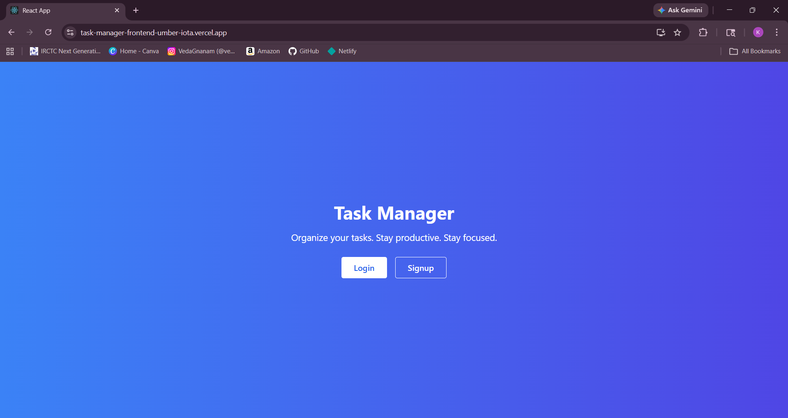
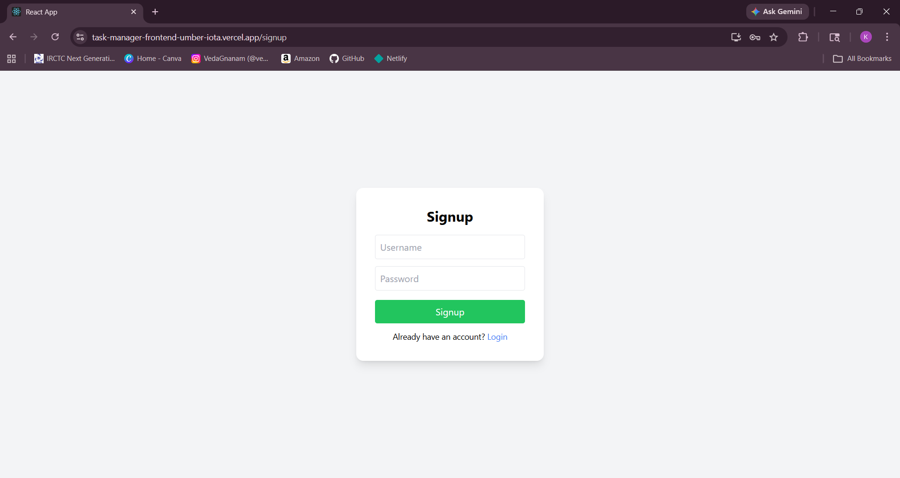
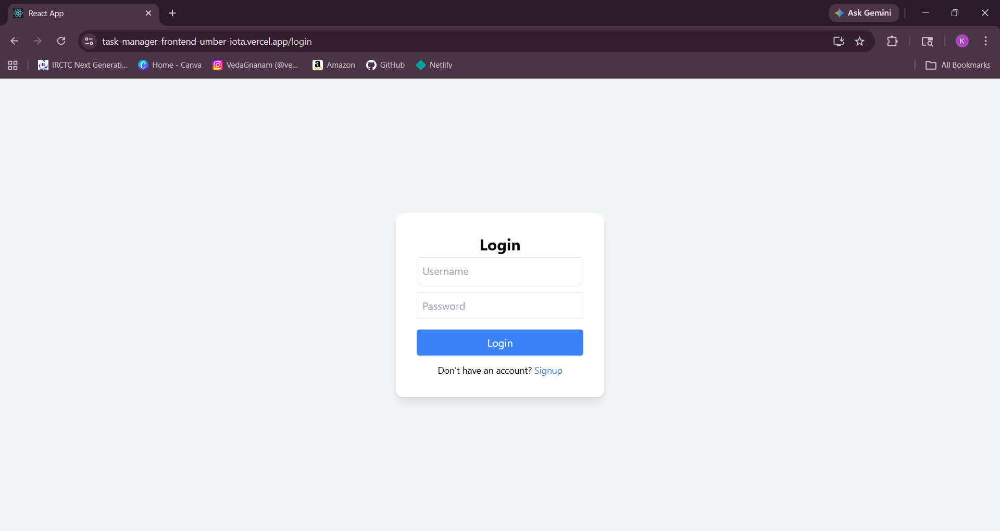
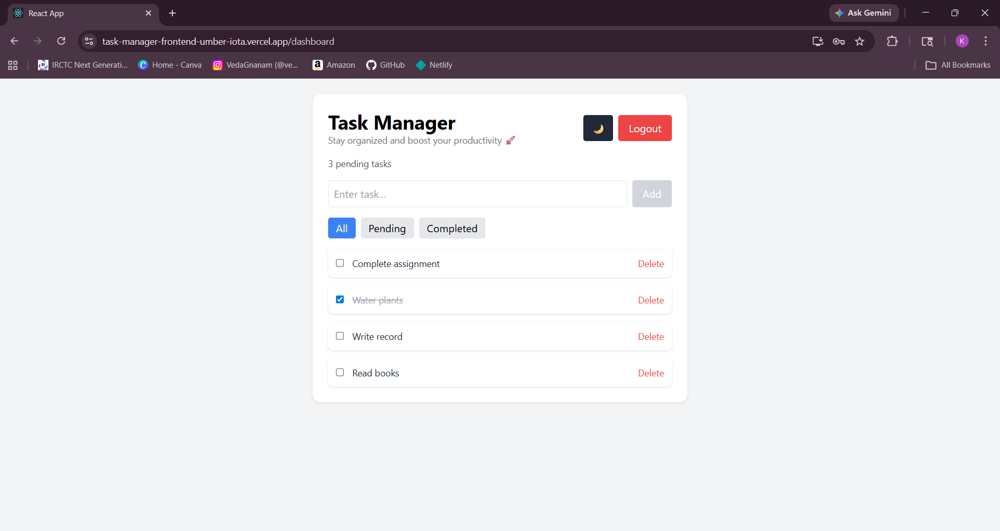

# 📝 Task Manager App

A full-stack Task Manager web application that allows users to manage their daily tasks efficiently with secure authentication.

---

## 🚀 Live Demo
👉 https://ayush-task-manager-dashboard.vercel.app/

---

## ⚙️ Backend API
👉 https://task-manager-backend-production-5224.up.railway.app/

---

## ✨ Features

- 🔐 User Authentication (Signup & Login using JWT)
- ➕ Add new tasks
- ✅ Mark tasks as completed
- ❌ Delete tasks
- 👤 User-specific task management
- 🔄 Persistent login (token-based)
- 📱 Clean and responsive UI

---

## 🛠️ Tech Stack

### Frontend
- React.js
- Tailwind CSS
- Axios
- React Router

### Backend
- Django
- Django REST Framework
- JWT Authentication

### Deployment
- Frontend: Vercel
- Backend: Railway

---

## 🧪 How to Run Locally

### 1. Clone the repo
git clone https://github.com/koayush1310/task-manager-frontend/
cd task-manager-frontend

### 2. Install dependencies
npm install

### 3. Start the app
npm start

---

## 📸 Screenshots

### 1. Home page

### 2. Signup Page

### 3. Login Page

### 3. Dashboard

### 4. Dashboard (Dark theme)

---

## 💡 Future Improvements
- Edit task feature
- Dark mode
- Due dates & reminders
- Better UI animations

## 👨‍💻 Author
Ayush

## 📌 Note
This project was built as part of a Full Stack Developer Internship assignment and demonstrates end-to-end development including authentication, API integration, and deployment.
